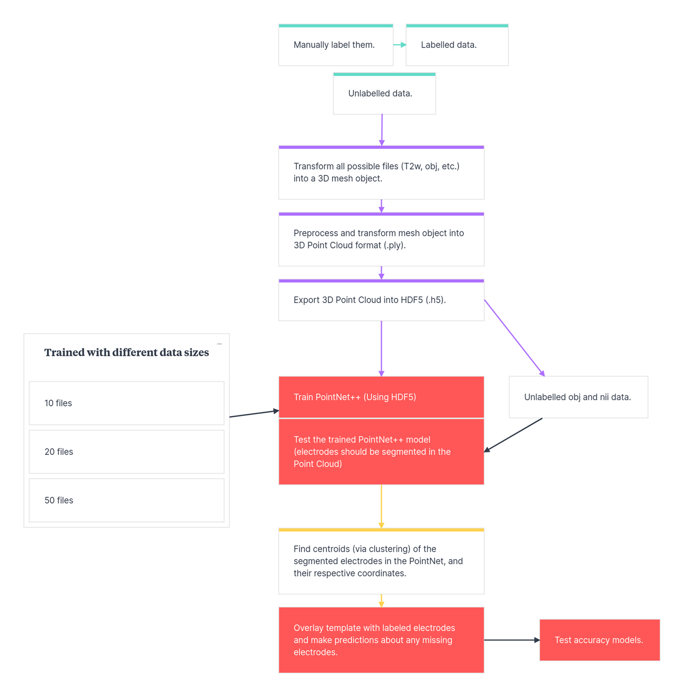

<!-- This is an html comment and this won't appear in the rendered page. You are now editing the "content" area, the core of your description. Everything that you can do in markdown is allowed below. We added a couple of comments to guide your through documenting your progress. -->

## Project definition

### Background

In EEG analysis that aims to localize the origin of brain signals, source localization requires a realistic head model and precise electrode coordinates to ensure spatial accuracy. However, current approaches to obtaining these coordinates are either time-consuming (e.g., manual labeling) or require specialized, often costly hardware/software. Both options demand technical expertise, posing barriers to widespread or streamlined use.

Further complicating matters, electrode localization must accommodate various data formats, such as MRI volumes (Pinte et al., 2021), 3D surface scans, and photogrammetry (Hirth et al., 2020). A robust solution must therefore be both format-agnostic and computationally efficient.

Recent innovations have begun to address this need: pipelines using mobile phones for 3D scanning (Everitt et al., 2023), algorithms that infer missing electrodes from partial montages (Hirth et al., 2020), and deep learning models applied to MRI-based localization (Pinte et al., 2021) have all demonstrated potential.

Building on these efforts, our project aims to develop a deep learning-based pipeline for electrode localization that is generalizable across file types and imaging modalities. The goal is to create a solution that reduces cost, minimizes manual labor, and increases accessibility—regardless of the acquisition method used.

#### Objectives
- Automate EEG electrode localization and labeling  
- Develop a flexible pipeline that can be applied to external datasets  
- Evaluate localization accuracy across data types (e.g., same-modality `.obj` vs. cross-modality T1-weighted MRI) to test generalizability  

#### Objectives for BrainHack school
- Gain hands-on experience with open-source tools, deep learning frameworks, and collaborative coding practices

### Tools

This project relies on the following tools:

- **GitHub** – For version control and collaborative development
- **VS Code** and **Jupyter Notebook** – For interactive and modular code development

Key libraries and components:

- **Open3D** – Convert surface and volume data into 3D point cloud format (`.ply`, `.npz`)
- **h5py** – Transform labeled and unlabeled 3D point clouds into HDF5 format
- **PointNet++** – Deep learning model for training and testing electrode localization and segmentation
- **K-Means Clustering** – Identify electrode centroids and extract their coordinates
- Custom alignment tools – Align electrode labels to head scans

### Data

The dataset includes 3D head models acquired using a portable 3D scanner (`.obj` files). A subset of participants also has T2-weighted MRI scans (`.nii`) acquired while wearing an EEG cap.

These data come from the study *Alpha Oscillations and Working Memory Deficits in ADHD: A Multimodal Imaging Investigation* (R01MH116268), available through the NIH Data Archive:  
[https://nda.nih.gov/edit_collection.html?id=3101](https://nda.nih.gov/edit_collection.html?id=3101)

### Deliverables

1. GitHub repository with our tools and code.
2. Documentation on how to train and test on different datasets.

## Results

### Progress Overview

We focused on preparing the dataset for training the PointNet++ model and developing a clustering pipeline to extract electrode coordinates once segmentation is complete. A subset of the dataset was manually labeled to create both labeled and unlabeled data for training and testing the model. 

We also built two tools to align electrode labels with the corresponding head model. To ensure compatibility with PointNet++, we converted the data into point cloud format and then into HDF5 files—both in labeled and unlabeled versions. Our preprocessing script accepts multiple input formats to support generalizability.

Additionally, we implemented a Python script using K-Means clustering to extract centroid coordinates from the segmented point clouds. These centroids are intended to serve as the localized electrode positions.

Next steps include training and evaluating the deep learning model. Given the limited dataset size, we are also exploring the possibility of augmenting the training set with synthetic data.

### Tools I Learned During This Project

- **GitHub**  
  We learned how to use GitHub for version control and collaborative development, enabling us to share and track changes to code and scripts across the team.

- **Jupyter Notebook**  
  We used Jupyter Notebooks to develop and test code in a modular, step-by-step fashion. This structure made it easier to isolate and debug issues and helped organize different components of the pipeline.

- **VS Code**  
  Visual Studio Code was valuable for integrating multiple development tools in one environment. We used it to write and manage code across files, run terminals, and install packages directly, streamlining the development workflow.

### Results

#### Deliverable 1: GitHub Repository

Although the project is still in progress and the GitHub repository does not yet contain the final versions of the scripts or a trained model, we have uploaded several core components. These include tools for aligning electrode labels with 3D head scans, scripts for preprocessing data for deep learning input, and post-segmentation clustering scripts to extract electrode coordinates from the model output.

#### Deliverable 2: Documentation

Although the deep learning model has not yet been trained or tested, we began preparing documentation that outlines the full electrode localization workflow. This includes a step-by-step description of the data preprocessing, model input/output formatting, and post-processing steps such as clustering for coordinate extraction.

To aid clarity and reproducibility, we created a visual representation of the workflow:

This diagram illustrates the full pipeline—from raw 3D scan input and manual labeling to PointNet++ segmentation and centroid estimation. Full documentation will be completed as the project advances and the model is finalized.

### Conclusion and Acknowledgements

Developing a generalizable and accessible tool for localizing EEG electrode coordinates would represent a meaningful advance in both clinical and research applications of EEG. While deep learning offers a promising route toward automation and scalability, it introduces limitations—particularly the need for large, labeled datasets and consistency in data acquisition setups. Despite these challenges, our approach demonstrates the potential for building a flexible pipeline that accommodates diverse file formats and EEG systems.

We plan to continue developing this project to assess the feasibility and accuracy of the proposed method.

We gratefully acknowledge the study *Alpha Oscillations and Working Memory Deficits in ADHD: A Multimodal Imaging Investigation* (R01MH116268) for providing access to the data used in this project. We also thank the BrainHack School for offering the time, support, and collaborative environment that enabled this work.

Sample data can be accessed at: [osf.io/87av2](https://osf.io/87av2)

## References

Diaz-Fong, J. P., & Lenartowicz, A. (2025, March 8). 3D Scanning Sample Data for EEG Electrode Localization. Retrieved from osf.io/87av2

Everitt, A., Richards, H., Song, Y., Smith, J., Kobylarz, E., Lukovits, T., Halter, R., & Murphy, E. (2023). EEG electrode localization with 3D iPhone scanning using point-cloud electrode selection (PC-ES). Journal of Neural Engineering, 20(6), 066033.

Hirth, L. N., Stanley, C. J., Damiano, D. L., & Bulea, T. C. (2020). Algorithmic localization of high-density EEG electrode positions using motion capture. Journal of neuroscience methods, 346, 108919. https://doi.org/10.1016/j.jneumeth.2020.108919.

Pinte, C., Fleury, M., & Maurel, P. (2021). Deep learning-based localization of EEG electrodes within MRI acquisitions. Frontiers in Neurology, 12, 644278.

Tveter, M., Tveitstøl, T., Nygaard, T., Kulashekhar, S., Bruña, R., Hammer, H. L., Hatlestad-Hall, C., & Haraldsen, I. R. H. (2024). EEG electrodes and where to find them: automated localization from 3D scans. Journal of Neural Engineering, 21(5), 056022."
