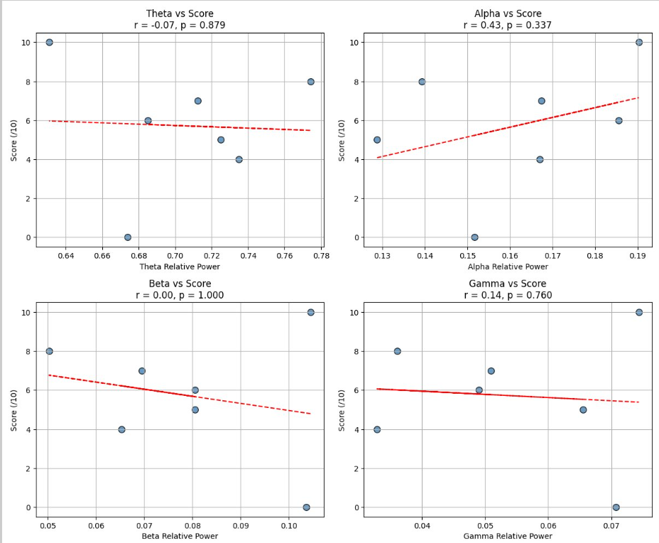
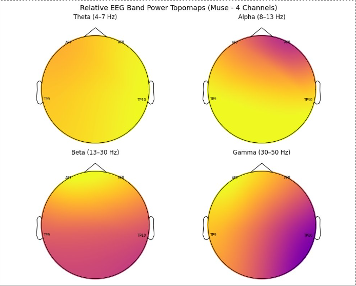

## Project definition
---
### Background

Cognitive states such as focus, relaxation, and arousal are known to influence athletic performance, particularly in precision sports like golf. Electroencephalography (EEG) offers a non-invasive way to monitor neural activity and derive insights about cognitive engagement through frequency band analysis. Prior studies have associated increased alpha and theta power with focused attention and automaticity, while beta and gamma activity are linked to heightened alertness and motor preparation.

The aim of this project is to explore how EEG-derived band power dynamics relate to subjective performance ratings of golf swings, as rated by the athletes themselves. This work contributes to a growing field of neurofeedback and cognitive training in sports.

### Tools
Python Libraries:
    MNE: EEG preprocessing and visualization
    numpy, pandas: Data manipulation
    matplotlib, seaborn: Plotting and statistical graphics
    scipy.stats: Correlation analysis
    sklearn: (optional for classification or clustering)

Signal Processing: Welch’s method for power spectral density estimation.

### Data
Participants: Golf athletes performing standardized swing tasks.
EEG Data: Multi-channel EEG signals recorded during golf swings.
Subjective Ratings: Swing quality scores rated by the athletes on a Likert-type scale immediately post-swing.
Electrode Layout: Standard 10-20 system with key channels such as Fz, Cz, Pz, etc.

### Pipeline
Preprocessing
Bandpass filter: 1–50 Hz
Artifact rejection (e.g., blink or muscle noise via thresholding or ICA)

Feature Extraction
Compute Relative Band Power for:
    Theta (4–8 Hz)
    Alpha (8–12 Hz)
    Beta (12–30 Hz)
    Gamma (30–45 Hz)
Normalize power per epoch across channels

Statistical Analysis
Correlation analysis: Pearson’s r between each frequency band (per channel) and shot quality scores.
Bootstrapping: Resample correlation coefficients to assess stability and confidence intervals, especially for alpha band (often hypothesized to relate to motor preparation).
Topographical Maps: Visualize band power distributions across the scalp for high- vs. low-rated swings

### Project deliverables 
At the end of this project, these files will be made available:
1) To extract relative band power (Theta, Alpha, Beta, Gamma) from EEG recordings during golf swing preparation and execution.
2) To assess the relationship between EEG features and subjective swing performance scores.
3) To explore statistical and visual analysis methods (e.g., correlation, bootstrapping, topographical mapping) that may inform real-time cognitive training tools.

## Results
Correlation Between EEG Band Power and Shot Score
Scatter plots were generated to assess linear relationships between relative EEG band power and subjective golf shot scores (rated out of 10). 
Key findings:
    Alpha band power showed a moderate positive correlation with shot scores (r = 0.43), suggesting increased alpha may relate to better perceived performance.
    Theta, Beta, and Gamma bands showed weak or no correlation with shot quality (r = -0.07, 0.00, and 0.14 respectively), indicating less consistent relationships.

##### Figure 1. Correlation between EEG power bands and score

EEG Topographical Maps
Topographic visualizations of average relative EEG power for each frequency band (from Muse headset – 4 channels) reveal distinct spatial patterns:
    Alpha activity is more prominent over posterior regions, consistent with literature linking it to relaxed focus and motor readiness.
    Gamma activity showed asymmetric right-side prominence.
    Beta and Theta distributions were more uniformly diffuse, with Beta slightly higher at posterior sites.

##### Figure 2. EEG Topographical Map for One Shot

### Tools I learned during this project
This project helped me build hands-on experience across several domains of neurodata analysis and scientific computing:
MNE-Python: I learned to use the MNE library to preprocess EEG data, extract band power using Welch’s method, and visualize scalp topographies. This was my first time working with MNE, and it gave me a strong foundation in EEG signal workflows.
Scipy.stats: I applied statistical functions such as Pearson correlation and bootstrapping to quantify relationships between brain activity and behavioral performance — gaining confidence in interpreting significance levels and confidence intervals.
Git & GitHub Workflow: I practiced version control using Git and contributed to the BrainHack School repository via pull requests. I also learned how to structure markdown-based project documentation.

## Conclusion and acknowledgement
This preliminary analysis supports the potential of EEG-based monitoring for assessing cognitive states in sports performance. Alpha power, in particular, may serve as a target for real-time neurofeedback to enhance swing execution. Future work could involve real-time decoding models, athlete-specific baselines, and integration into wearable feedback systems.  

I would like to thanks all the Brainhack School organizators and all the crew. Mostly, thanks for this awesome opportunity!

## References
Crews, D. J., & Landers, D. M. (1993). Electroencephalographic measures of attentional patterns prior to the golf putt. Medicine & Science in Sports & Exercise, 25(1), 116–126. https://doi.org/10.1249/00005768-199301000-00018

Gramfort, A., Luessi, M., Larson, E., Engemann, D. A., Strohmeier, D., Brodbeck, C., ... & Hämäläinen, M. S. (2013). MEG and EEG data analysis with MNE-Python. Frontiers in Neuroscience, 7, 267. https://doi.org/10.3389/fnins.2013.00267

Mirifar, A., Beckmann, J., & Ehrlenspiel, F. (2017). Neurofeedback as supplementary training for optimizing athletes' performance: A systematic review with implications for future research. Neuroscience & Biobehavioral Reviews, 75, 419–432. https://doi.org/10.1016/j.neubiorev.2017.02.005
